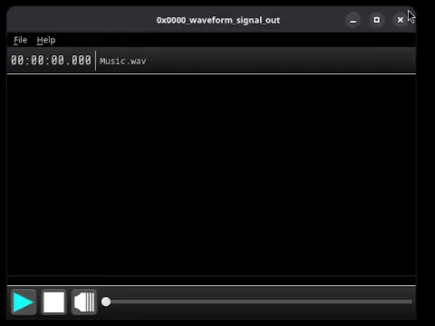
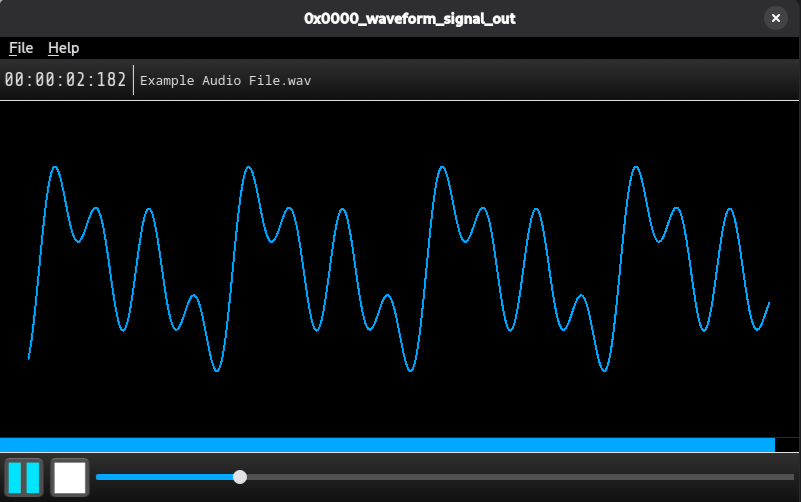

# 0x0000_waveform_signal_out

Copyright (c) 2026 Berke

An open-source desktop music player application featuring a real-time waveform visualizer.

  

## Overview

This application is an audio player built with Python and PySide6, designed to render real-time waveforms while playing your favorite audio tracks.

### Key Features
* **Real-time Waveform Visualization:** See your audio signal processed and rendered on the fly.
* **Open Source & Extensible:** Built on a clean architecture split into core, services, and UI modules.

## Screenshots

  

## License

This project is licensed under the GNU General Public License v3.0 or later (GPLv3+).  
See the [LICENSE.txt](LICENSE.txt) file for details.

## Third-Party Components

This application uses the following open-source components:

* **PySide6 / Qt** (LGPLv3)
* **NumPy**
* **sounddevice**
* **soundfile**
* **Python**
* **Share Tech Mono font** (OFL)
* **Noto Sans Mono font** (OFL)

Their respective license texts are included in the `third_party_licenses` directory.

> **Note on LGPL Compliance:**  
> PySide6 (Qt) is dynamically linked in accordance with LGPL requirements. Users may replace or modify the Qt libraries under the terms of the LGPL.

